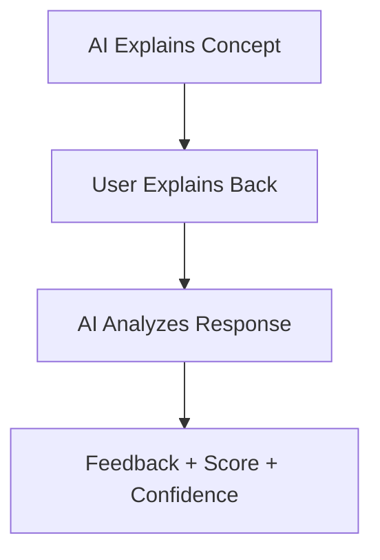

# 🧠 NeuralPath — AI-Powered Learning Companion

NeuralPath is an intelligent learning system that transforms passive studying into **active understanding**.
It combines AI, voice interaction, and cognitive science principles to ensure users **truly learn, not just memorize**.

---

## 🚀 Live Demo

🔗 *[Add your deployed link here]*

---

## 🎯 Problem Statement

Most students:

* Memorize without understanding ❌
* Cannot explain concepts clearly ❌
* Forget quickly after studying ❌

NeuralPath solves this using **active recall + AI feedback**.

---

## 💡 Solution

NeuralPath follows a powerful 3-step learning loop:

1. **AI Explains** → Concept is introduced clearly
2. **You Explain Back** → Using text or voice
3. **AI Evaluates** → Gives deep, structured feedback

---

## 🧠 Core Features

### 🎤 Voice-Based Learning

* Speak your explanation naturally
* Real-time speech-to-text
* Works even with pauses and slow speaking

---

### 📊 Understanding Score

* Measures how well you understood the concept
* Based on key concept matching
* Highlights missing knowledge

---

### 🕵️ Authenticity Detection (Anti-Cheat)

* Detects overly perfect / copied responses
* Identifies shallow understanding
* Encourages genuine learning

---

### 🧠 Confidence Analysis

* Evaluates how confidently you explain
* Detects hesitation and clarity
* Suggests improvement areas

---

### 📈 Smart Feedback System

AI provides:

* ✅ What you got right
* ❌ What you got wrong
* ⚠️ What you missed
* 💡 How to improve

---

### 🔁 Active Recall Engine

Based on:

* Feynman Technique
* Testing Effect
* Cognitive Reinforcement

---

## 🧬 How It Works



---

## ⚙️ Tech Stack

### Frontend

* HTML
* CSS
* Vanilla JavaScript

### Backend

* Node.js
* Express.js

### AI Integration

* Groq API (LLM-based evaluation)

---

## 🛠️ Setup Instructions

### 🔧 Backend Setup

```bash
cd backend
npm install
cp .env.example .env
```

Add your API key in `.env`

Then run:

```bash
npm start
```

---

### 🌐 Frontend Setup

Simply open:

```bash
frontend/index.html
```

No build required.

---

## 🔌 API Endpoints

* `POST /api/explain`
* `POST /api/feedback`
* `POST /api/quickexplain`
* `POST /api/relatedconcept`

---

## 🎯 Key Highlights

* 🎤 Voice-first interaction
* 🧠 Real understanding detection
* 🕵️ Anti-cheat intelligence
* 📊 Measurable learning outcomes
* ⚡ Fast and lightweight

---

## 🏆 Why NeuralPath Stands Out

> NeuralPath doesn't just check answers —
> it evaluates **how deeply you understand**.

Unlike traditional platforms:

* It listens
* It analyzes
* It adapts

---

## 🚀 Future Scope

* 📊 Full progress dashboard
* 🧬 Personalized learning paths
* 🧑‍🤝‍🧑 Peer comparison mode
* 🎮 Gamification system

---

## 👨‍💻 Author

**Vishant Pandey**
Engineering Student | AI Enthusiast

---

## 📌 Final Note

NeuralPath is not just a tool —
it is a step toward **intelligent, personalized education**.

---

⭐ If you like this project, consider starring the repository!

